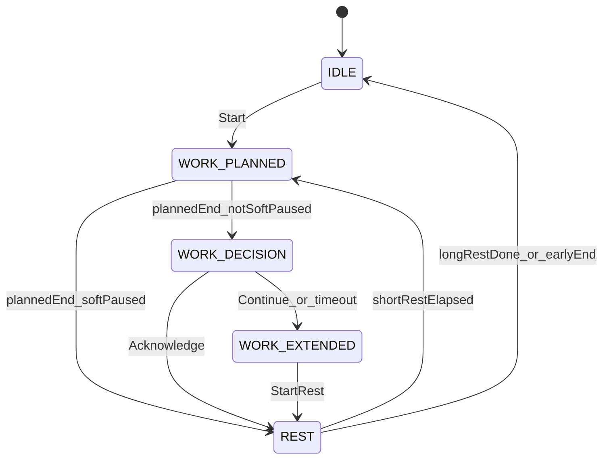

# M1 – Timer Core

## Scope (from PRD §12)

**In:** separate planned-work / extended-work / rest shapes, defaults + session overrides, committed session lock, decision window, extended work, soft pause (including soft-paused-at-planned-end → auto-rest), unique alert hooks with placeholder sounds, Docker.

**Out (later milestones):** hard-pause module + `WorkPauseStrategy` encapsulation (M2), SQLite + wall-clock recovery (M3), analytics UI (M4), curated sounds / mute / export / proxy docs (M5).

## Stack (locked)

- **Frontend:** Vite + React + TypeScript
- **Backend:** Fastify + TypeScript (session engine is source of truth)
- **M1 persistence:** in-memory settings + active session (lost on restart is acceptable until M3)
- **Packaging:** single multi-stage Docker image; Fastify serves the built SPA + `/api/*`
- **Monorepo layout:** npm workspaces

```text
/
  apps/web/          # Vite React SPA
  apps/server/       # Fastify API + session engine
  packages/shared/   # phase types, settings schema, API DTOs
  Dockerfile
  docker-compose.yml
```

## Architecture



- Server owns wall-clock anchors (`plannedEndAt`, phase `startedAt`, decision deadline).
- **Transport (hybrid, no WebSockets):**
  - Snapshot includes wall-clock anchors + `serverNow`; the UI interpolates remaining/overtime time locally (no sub-second network for the digits).
  - **SSE** `GET /api/session/events` pushes phase transitions and `pendingAlerts` when the server advances state.
  - **POST** actions return the new snapshot immediately (optimistic UI path).
  - **Slow poll fallback:** `GET /api/session` every **5 minutes** while a session is active, plus on tab focus / SSE reconnect — recovery if the event stream drops. No 250–500ms polling.
- Soft pause is implemented **inline** in the planned-work phase for M1 (behavior per FR-PAUSE-S*). Extract to `WorkPauseStrategy` in M2; do not scatter soft/hard conditionals yet—hard pause is absent.

### Distinct phase types (FR-SHAPE)

In `packages/shared` and the engine, model separate types—not one `WorkSegment` with a kind flag for policy:

- `PlannedWorkPhase` — fixed `plannedEndAt`, soft-pause accumulator
- `DecisionPhase` — `decisionEndsAt`
- `ExtendedWorkPhase` — no planned end; only “Start rest”
- `RestPhase` — `kind: short_rest | long_rest`; early-end only if long

## Server: session engine

Core module: `apps/server/src/session/engine.ts` (+ pure transition helpers for unit tests).

**Settings (in-memory, with defaults):**

```ts
workDurationSec, shortRestDurationSec, cyclesBeforeLongRest,
longRestDurationSec, decisionWindowSec (10–20, default 15),
alertsMuted (store field; M1 UI can ignore mute),
workPauseStrategy: "soft" // hard ignored/hidden until M2
```

**API surface (M1):**

| Method | Path | Purpose |
| --- | --- | --- |
| GET | `/api/health` | Docker/orchestration smoke |
| GET/PUT | `/api/settings` | Defaults |
| GET | `/api/session` | Current session snapshot or idle (also used for 5-minute poll fallback) |
| GET | `/api/session/alert-seq` | Current `alertSeq` high-water (no history; client sync on startup / reconnect / idle) |
| GET | `/api/session/events` | SSE stream of phase transitions + pendingAlerts |
| POST | `/api/session/start` | Body: optional overrides; lock params; start cycle 1 work |
| POST | `/api/session/ack-rest` | Decision → rest |
| POST | `/api/session/continue` | Decision → extended |
| POST | `/api/session/start-rest` | Extended → rest (no end-extended alert flag) |
| POST | `/api/session/soft-pause` | Planned work only |
| POST | `/api/session/soft-resume` | Planned work only |
| POST | `/api/session/end-long-rest` | Long rest → idle |

**Engine rules to enforce:**

- No cancel/stop while active (FR-SESS-4)
- After start, params locked; no duration increases (FR-SET-3–5)
- Soft pause: countdown continues; `plannedEndAt` unchanged; accumulate `softPausedSec` (FR-PAUSE-S2–S4)
- Soft-paused at planned end → skip decision → auto rest + alert cues `work_planned_end` + rest-entry (FR-PAUSE-S7)
- Decision timeout → extended + `extended_work_auto_start` (FR-FLOW-4)
- Short rest: not skippable/pausable; then auto next work (FR-SESS-5, FR-SESS-10)
- After cycle N → long rest; early end → idle, no auto-start (FR-SESS-7–9)
- Rest length never scaled by overtime (FR-FLOW-8)

**Tick:** Fastify `setInterval` (~250ms) advances phases from wall clock; responses include `serverNow` so the UI can render without drift.

**Alert events:** session snapshot includes `pendingAlerts: AlertEvent[]` (`{ seq, id }` deltas since client watermark) plus `alertSeq` high-water. Client plays placeholder audio once per event. Alert ids: `work_planned_end`, `rest_ack` / short|long rest start, `short_rest_end`, `long_rest_end`, `extended_work_auto_start`. Manual extended end and early long-rest end emit **no** end alarm.

## Web UI

Surfaces for M1 (PRD §6.1–6.2, timer-focused):

1. **Timer / session** — primary composition: phase label, large mm:ss (count-up overtime for extended), cycle `k / N`, decision countdown copy, actions matching state machine, soft-pause control on planned work only, **no Stop session**.
2. **Defaults** — edit/persist settings; clear “Defaults” vs “This session” on start form (overrides for work / short rest / N / long rest).
3. Stub nav only for Analytics / About (empty or “coming later”)—do not build analytics.

UI units: minutes in settings; live timer mm:ss (PRD Q8 default).

Keep the timer screen one calm composition (existing design rules apply when styling).

## Alerts (placeholders)

- Ship 6 distinct short **LLM-generated** placeholder tones under `apps/web/public/alerts/` (e.g. `placeholder-*.wav` / `.ogg`), one per alert id. These are temporary M1 assets only; M5 replaces them with owner-picked free/open-license samples (PRD: no LLM tones as product defaults).
- Client audio helper maps alert id → file; unlock on first user gesture (Start).
- Document autoplay constraint in a short code comment near the helper (full docs in M5).

## Docker

- Multi-stage: build workspaces → runtime Node image with `apps/server` serving static `apps/web/dist`
- `docker-compose.yml`: port `8080`, optional `TZ`, volume mount stub `/data` (unused until M3—keeps compose shape stable)
- Env: `PORT`, `TZ`
- Verify: `docker compose up` → UI loads; `/api/health` OK

## Tests (M1)

Unit-test the pure engine transitions (no browser):

- Full happy path N=2 with ack → short rest → auto work → long rest → idle
- Decision timeout → extended → start rest (no extended-end alert)
- Soft pause mid-work; planned end unchanged
- Soft-paused through planned end → auto rest, skip decision
- Reject cancel / early short-rest / duration bump after start
- N=1 → long rest only after first work path

## Explicit non-goals for this milestone

- Hard pause UI/setting
- SQLite, segment tables, refresh/container recovery
- Analytics dashboard
- Multi-tab coordination beyond “last writer / single session” best-effort
- Auth, PWA, final sound pack

## Implementation order

1. Scaffold monorepo + shared types + Fastify skeleton + Vite app + Docker
2. Implement session engine + API + unit tests
3. Wire timer UI + settings/overrides + soft pause + decision/extended flows
4. SSE + local clock interpolation + 5-minute poll fallback; LLM placeholder alert playback from `pendingAlerts`
5. Docker compose smoke + manual walkthrough of PRD §4.7.4 timeline
