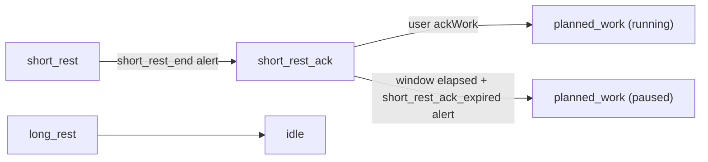

# M2.5 – Short-rest ack + live session stats

Sources: [docs/product/PRD.md](docs/product/PRD.md) §4.3 (FR-ALERT), §4.7.3 (FR-ACK), §4.8 (FR-AN-8), §5 state machine; Notion [FPMD-18](https://app.notion.com/p/3b8c8329801e819ba802ede89f8891b2). Prerequisite: [M2 pause modules](.cursor/plans/m2_pause_modules.plan.md) is complete.

## Current gap

M2 shipped pluggable pause strategies, but short rest still **auto-starts running work**:

```424:431:apps/server/src/services/session.service.ts
    if (phase.kind === "short_rest") {
      this.emitAlerts("short_rest_end");
      session.phase = startPlannedWork(
        session.params,
        phase.cycleIndex + 1,
        restEndedAtMs,
      );
```

There is no `short_rest_ack` phase kind, no ack-work command, no `short_rest_ack_expired` alert, and no live stats on [`ActiveSession`](packages/shared/src/index.ts). The happy-path test explicitly expects the old behavior (`planned_work` immediately after short rest).

## Scope

**In (FPMD-18 / PRD M2.5):**

- FR-ACK: `SHORT_REST_ACK` after **short rest only**; reuse `decisionWindowSec` (10–20s, FR-ACK-2)
- Ack → next-cycle `planned_work` **running** (FR-ACK-3)
- Timeout → next-cycle `planned_work` **immediately paused** via active `WorkPauseStrategy.onPause()` (FR-ACK-4); fires new `short_rest_ack_expired` alert
- FR-AN-8: in-memory live stats — `workedSec`, `deliberationSec` (decision + ack combined), `restSec`
- Context-aware stat attribution: work-decision timeout folds into `workedSec`; all other decision/ack time goes to `deliberationSec`
- Decision/ack logic in `session.service.ts` — private methods, `addDeliberation` helper, and command handlers
- Frontend-only experimental preference: hide "Continue working" button in decision phase
- Unit tests + manual smoke for both pause strategies

**Out:**

- `ShortRestAckSegment` persistence (M3 — FR-ACK-6)
- Idle today aggregates (M3.5 — FR-AN-9)
- Analytics dashboard / charts (M4)
- Container restart recovery for ack window (M3 — S8)

## Target state machine delta



Long rest path unchanged — **no** ack phase.

## Alert transition map

All existing alerts are preserved with unchanged trigger points. Only the post-`short_rest_end` transition changes (was → `planned_work`, now → `short_rest_ack`).

| Alert | Trigger | M2.5 change? |
|---|---|---|
| `work_planned_end` | Planned work timer expires | None |
| `rest_ack` | User acks from work decision | None |
| `short_rest_start` | Entering short rest | None |
| `short_rest_end` | Short rest timer expires | **Same fire point; transition now goes to `short_rest_ack` instead of `planned_work`** |
| `long_rest_start` | Entering long rest | None |
| `long_rest_end` | Long rest timer expires | None |
| `extended_work_auto_start` | Work decision timeout | None |
| `short_rest_ack_expired` | **New** | Fires on ack window timeout, immediately before work starts paused. Distinct loud sound. Does **not** fire on explicit user ack (user-initiated, per FR-ALERT-5 principle). |

## Execution order

### 1. Types + API

**Files:** [`packages/shared/src/index.ts`](packages/shared/src/index.ts), [`apps/server/src/routes/session.routes.ts`](apps/server/src/routes/session.routes.ts)

**Phase type** — widen `DecisionPhase.kind` and `PhaseKind` to include `"short_rest_ack"`. No new interface or `Phase` union member — `short_rest_ack` shares the same shape as `decision` (`cycleIndex`, `startedAt`, `decisionEndsAt`, `decisionWindowSec`):

```ts
export interface DecisionPhase {
  kind: "decision" | "short_rest_ack";  // widened
  cycleIndex: number;
  startedAt: string;
  decisionEndsAt: string;   // serves as the deadline for both kinds
  decisionWindowSec: number;
}

// PhaseKind widens to include "short_rest_ack"
// Phase union is unchanged — DecisionPhase already covers both kinds
```

**Alert** — add to `AlertIdSchema`:

```ts
"short_rest_ack_expired"  // ack window timed out → work starting paused
```

**Live stats** — add `SessionLiveStats` to `ActiveSession`:

```ts
export interface SessionLiveStats {
  workedSec: number;        // planned focus + extended (soft-paused time excluded)
  deliberationSec: number;  // work-decision elapsed (explicit act only) + ack elapsed (always)
  restSec: number;          // short rest + long rest
}
```

Initialize to `{ workedSec: 0, deliberationSec: 0, restSec: 0 }` at `session.start()`. Reset on session complete.

**Route** — add `SESSION_API.ackWork: "/api/session/ack-work"` (distinct from `ackRest` which is decision → rest). Register in [`session.routes.ts`](apps/server/src/routes/session.routes.ts).

### 2. Decision and ack logic

**File:** [`apps/server/src/services/session.service.ts`](apps/server/src/services/session.service.ts)

Decision and ack policies live in `session.service.ts` — fixed policies, not runtime-swappable like pause strategies.

**`addDeliberation(session, phase, nowMs)`** — module-level helper; attributes elapsed window time to `deliberationSec`. Called by explicit-act commands before their transitions.

**`advanceWorkDecision`** — when `decisionEndsAt` is due: add full window to `workedSec`; enter `extended_work` backdated to decision start; emit `extended_work_auto_start`.

**`advanceShortRestAck`** — when due: add full window to `deliberationSec`; emit `short_rest_ack_expired`; start next-cycle `planned_work`; call `pausePlugin.onPause`.

**Commands:**

| Command | Behavior |
|---|---|
| `ackRest` | `addDeliberation` for elapsed; `enterRestFromWork` (+ `rest_ack`) |
| `continueExtended` | `addDeliberation` for elapsed; `extended_work` at click |
| `ackWork` | `addDeliberation` for elapsed; next-cycle `planned_work` running |

### 3. Engine wiring

**File:** [`apps/server/src/services/session.service.ts`](apps/server/src/services/session.service.ts)

**Tick dispatch:**

```ts
case "decision":
  return this.advanceWorkDecision(session, phase, nowMs);
case "short_rest_ack":
  return this.advanceShortRestAck(session, phase, nowMs);
```

**Short rest end** — `advanceRest` for `short_rest` enters `short_rest_ack` (does not auto-start work):

```ts
this.emitAlerts("short_rest_end");
this.enterShortRestAckPhase(session, phase, restEndedAtMs);
```

**Rejections** — `pause()` / `resume()` reject non-`planned_work` phases via `requirePhase`; `short_rest_ack` gets the same rejection automatically.

**Planned-work stats** — single formula: wall elapsed − total paused (closed + open). Same for soft and hard.

**Snapshot** — `buildSnapshot` overlays in-progress stats from the current phase at `serverNow` via `liveStatsWithProgress()`, using the same phase-progress formulas as the client HUD.

### 4. Timer UI

**Files:** [`apps/web/src/components/timer/ActiveTimer.tsx`](apps/web/src/components/timer/ActiveTimer.tsx), [`apps/web/src/components/timer/timerDisplay.module.css`](apps/web/src/components/timer/timerDisplay.module.css), [`apps/web/src/components/TimerTab.tsx`](apps/web/src/components/TimerTab.tsx), [`apps/web/src/utils/liveStats.ts`](apps/web/src/utils/liveStats.ts), [`apps/web/src/queries/useSessionApi.ts`](apps/web/src/queries/useSessionApi.ts), [`apps/web/src/browserFlags/`](apps/web/src/browserFlags/), [`apps/web/src/components/SettingsTab.tsx`](apps/web/src/components/SettingsTab.tsx), [`apps/web/src/constants/about.ts`](apps/web/src/constants/about.ts)

**Data flow** — pass the snapshot once; derive session fields inside consumers:

- `TimerTab` → `ActiveTimer`: `snapshot`, `now` (from `useNow()`), `onAction`
- `ActiveTimer` reads `phase`, `params`, `pauseStrategy` from `snapshot.session`
- Helpers that need session fields take `snapshot` (`displayClock`, `actionsForPhase`), not loose props

**Ack phase** — `short_rest_ack` shares `DecisionPhase`'s shape, so existing UI functions need only new cases added, nothing rewritten:

- `phaseTitle`: `short_rest_ack` → `"Start work?"`
- `displayClock`: extend the existing `decision` condition — `phase.kind === "decision" || phase.kind === "short_rest_ack"` — reads the same `phase.decisionEndsAt` field
- `phaseHint`: add `short_rest_ack` case returning `"Acknowledge to start work — or work starts paused"`
- `actionsForPhase(snapshot, …)`: add `short_rest_ack` case with single primary action — **Acknowledge** → `SESSION_API.ackWork`

**Layout** — top → bottom: phase label → countdown → cycle → hint (if any) → action buttons → live stats.

**Live stats HUD** — three counters (Worked / Deliberation / Rest), label-over-value per stat, below the action buttons. Use `formatMmSs` from existing time utils.

- Labels: uppercase, `0.85rem`
- Values: fixed `1.75rem`, `font-body` (decoupled from countdown's `vw`-scaled display font)
- Countdown: `clamp(5.25rem, 22vw, 8.75rem)`, `font-display`

**Client-side ticking** — stats tick in real time like the countdown via [`liveStatsAt(snapshot, nowMs)`](apps/web/src/utils/liveStats.ts):

1. Start from `snapshot.session.liveStats` (committed + in-phase progress at `serverNow`)
2. Strip current-phase progress at `Date.parse(snapshot.serverNow)`
3. Re-add current-phase progress at local `nowMs` from `useNow()` (250ms while active)

Countdown uses the same pattern: absolute ISO anchors + local `now`. Phase transitions are server-authoritative via SSE. No client clock-offset sync — hour-scale sessions and typical NTP skew are sufficient.

**Browser flags** — shared factories under `apps/web/src/browserFlags/`:

```
browserFlags/
  createFlagCatalog.ts    # ids, meta, isEnabled (no Zod)
  createFlagStore.tsx
  persistedState.ts
  readStoredRecord.ts
  debug/                  # gate + catalog + provider
  ui/                     # no gate + catalog + provider
```

- **Debug:** `hasGate: true` (`debugMode` gate). Server contract in `packages/shared/src/debug/` (`parseDebugFlags`, Zod schema, bounds for `shortDurations`). Web labels/meta in `browserFlags/debug/features/`. Key: `flexi-pomodoro:debugFlags`.
- **UI:** `hasGate: false` (preferences always available). Plain TS catalog in `browserFlags/ui/` — no Zod. Key: `flexi-pomodoro:uiFlags` as `{ flags: { … } }`.
- App code imports from `browserFlags/debug` and `browserFlags/ui` (no root barrel).

One preference to start: `hideContinueButton: boolean` (default `false` — button shown). Exposes `useUiFlags()`.

**Settings tab layout** — `SettingsTab.tsx`:

```
Settings
  [form fields: Work, Short rest, Cycles, Long rest, Decision window]

  Experimental features
    [ ] Enable experimental features
      [ ] Enable hard pause (experimental)   ← server setting, saved via Save defaults

  [Save defaults]

  Browser preferences                        ← separate from server settings
    [ ] Hide "Continue working" button
        Work auto-extends if you ignore the timer.
        Hiding removes the explicit shortcut.

  Debug                                      ← bottom; for developers only
    [ ] Enable debug mode
      [ ] Short durations
```

"Browser preferences" uses the same `styles.debugFlags` / `styles.debugFlag` CSS classes as the Debug section. No gate checkbox — preferences are always visible and individually toggled. Reads/writes via `useUiFlags()`.

In `actionsForPhase`, read `useUiFlags().isEnabled("hideContinueButton")`; omit the Continue action from the `decision` phase when true.

**Toasts** — add to `useSessionApi.ts`:

```ts
[SESSION_API.ackWork]: "Work started",
```

**About** — add to `FEATURES` array in [`apps/web/src/constants/about.ts`](apps/web/src/constants/about.ts):

```ts
{ label: "Short-rest acknowledgement", status: "available" },
{ label: "Live session stats", status: "available" },
```

### 5. Tests + smoke

**Files:** [`apps/server/src/tests/services/session.service.test.ts`](apps/server/src/tests/services/session.service.test.ts)

**Update existing:**

- Happy path N=2: short rest → `short_rest_ack` → `ackWork` → running cycle-2 `planned_work`
- `short_rest_end` still fires at rest end

**Add:**

| Case | Expect |
|---|---|
| Explicit ack (soft) | `planned_work` cycle 2, `paused: false`, `timerFrozenAt: null` |
| Explicit ack (hard) | same; no freeze since not paused |
| Ack timeout (soft) | `planned_work` cycle 2, `paused: true`, `timerFrozenAt: null`; `short_rest_ack_expired` alert fires |
| Ack timeout (hard) | `planned_work` cycle 2, `paused: true`, `timerFrozenAt` set; clock frozen in UI |
| Long rest end | idle; never enters `short_rest_ack` |
| Pause during ack | `INVALID_PHASE` |
| Work-decision timeout | full window duration in `workedSec`; not `deliberationSec` |
| Work-decision explicit act | elapsed to click in `deliberationSec`; not `workedSec` |
| Ack explicit act | elapsed to click in `deliberationSec` |
| Ack timeout | full window duration in `deliberationSec` |
| Live stats full cycle | worked ≈ work duration, deliberation ≈ any decision/ack elapsed, rest ≈ short rest duration; soft-paused time excluded from worked |

**Manual smoke (FPMD-18 acceptance):**

1. Soft pause default → short rest ends → ack window opens (countdown, hint visible) → acknowledge → work starts running; repeat, let timeout → `short_rest_ack_expired` sounds → work starts paused → Resume works
2. Enable hard pause → timeout path → paused work has frozen clock → Resume shifts deadline
3. Complete session via long rest → no ack prompt
4. HUD worked / deliberation / rest counters increment during session; reset to zero on next session start
5. Check "Hide Continue working" in Browser preferences → decision phase shows only Acknowledge rest; uncheck → Continue reappears

## Key design decisions

- **`DecisionPhase.kind` widened, no new interface** — `short_rest_ack` shares `DecisionPhase`'s shape (`decisionEndsAt`, `decisionWindowSec`). `Phase` union unchanged. Existing UI branches in `ActiveTimer.tsx` extended with new cases rather than rewritten.
- **Decision/ack logic in `session.service.ts`** — `addDeliberation` helper; private methods `advanceWorkDecision`, `advanceShortRestAck`; commands `ackRest`, `ackWork`, `continueExtended`. Fixed policies, not runtime-swappable like pause strategies.
- **Stat attribution at the transition** — deliberation on explicit act; work-decision timeout → `workedSec`; ack timeout → `deliberationSec`. Planned-work `workedSec` is wall elapsed − total paused (same for soft and hard).
- **Merged `deliberationSec`** — work-decision (explicit act only) + ack (always) shown as one "Deliberation" counter in the HUD. Work-decision timeout folds into `workedSec` per FR-FLOW-11. Distinction between ack-acked vs ack-timeout preserved in M3 `ShortRestAckSegment` outcome field.
- **`short_rest_ack_expired` alert** — new, loud, distinct sound. System-driven boundary only; explicit ack fires no alert per FR-ALERT-5 principle.
- **Snapshot as UI source of truth** — `TimerTab` / `ActiveTimer` pass `ActiveSnapshot` + local `now`; no redundant prop drilling of `phase`, `params`, or `pauseStrategy`. Helpers derive from `snapshot.session` internally.
- **Live stats client extrapolation** — snapshot `liveStats` includes in-phase progress at `serverNow`; client `liveStatsAt()` strips at `serverNow` and re-adds at local `now` so the HUD ticks with `useNow()` (250ms), matching countdown behavior. Formulas in `apps/web/src/utils/liveStats.ts` mirror server `liveStatsWithProgress`.
- **No clock-drift sync** — countdown and stats use absolute ISO anchors + local `Date.now()`. Phase transitions are server-authoritative via SSE. Hour-scale sessions and typical NTP skew make offset correction unnecessary.
- **Browser flag stores** — debug and UI share `apps/web/src/browserFlags/` (`createFlagCatalog`, `createFlagStore`, `readStoredRecord`). Symmetric layout: `browserFlags/debug/provider.tsx` and `browserFlags/ui/{catalog,features,provider}.tsx`. Debug uses `hasGate: true`; UI uses `hasGate: false` (gate always on). Server debug contract in `packages/shared/src/debug/` (bounds + `parseDebugFlags`); web catalogs for labels. UI flags are plain TS — no Zod. Key: `flexi-pomodoro:uiFlags` as `{ flags: { … } }`.
- **Browser preferences separate from debug flags and server settings** — hiding Continue is an end-user preference, not a developer feature and not a server setting. Rendered in a dedicated "Browser preferences" section below Save defaults and above Debug.
- **Separate `ackWork` endpoint** — avoids overloading `ackRest` (decision → rest vs ack → work).
- **Time representation** — ISO-8601 on wire/shared model (`startedAt`, `plannedEndAt`, `decisionEndsAt`, `serverNow`); ms numbers inside the engine (`nowMs`, `elapsedSecFromIso`). `parseIso`/`msToIso` are the boundary.
