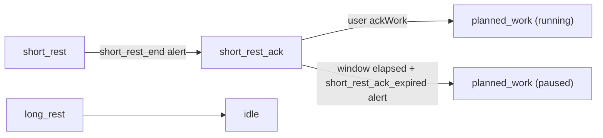

# M2.5 – Short-rest ack + live session stats

Sources: [docs/product/PRD.md](docs/product/PRD.md) §4.3 (FR-ALERT), §4.7.3 (FR-ACK), §4.8 (FR-AN-8), §5 state machine; Notion [FPMD-18](https://app.notion.com/p/3b8c8329801e819ba802ede89f8891b2). Prerequisite [M2 pause modules](.cursor/plans/m2_pause_modules.plan.md) is complete.

## Current gap

M2 shipped pluggable pause strategies, but short rest still **auto-starts running work**:

```424:431:apps/server/src/services/session.service.ts
    if (phase.kind === "short_rest") {
      this.emitAlerts("short_rest_end");
      session.phase = startPlannedWork(
        session.params,
        phase.cycleIndex + 1,
        restEndedAtMs,
      );
```

There is no `short_rest_ack` phase kind, no `DecisionStrategy` abstraction, no ack-work command, no `short_rest_ack_expired` alert, and no live stats on [`ActiveSession`](packages/shared/src/index.ts). The happy-path test explicitly expects the old behavior (`planned_work` immediately after short rest).

## Scope

**In (FPMD-18 / PRD M2.5):**

- `DecisionStrategy` contract with two fixed implementations — `workDecision` and `shortRestAck`
- FR-ACK: `SHORT_REST_ACK` after **short rest only**; reuse `decisionWindowSec` (10–20s, FR-ACK-2)
- Ack → next-cycle `planned_work` **running** (FR-ACK-3)
- Timeout → next-cycle `planned_work` **immediately paused** via active `WorkPauseStrategy.onPause()` (FR-ACK-4); fires new `short_rest_ack_expired` alert
- FR-AN-8: in-memory live stats — `workedSec`, `deliberationSec` (decision + ack combined), `restSec`
- Context-aware stat attribution: work-decision timeout folds into `workedSec`; all other decision/ack time goes to `deliberationSec`
- Frontend-only experimental preference: hide "Continue working" button in decision phase
- Unit tests + manual smoke for both pause strategies

**Out:**

- `ShortRestAckSegment` persistence (M3 — FR-ACK-6)
- Idle today aggregates (M3.5 — FR-AN-9)
- Analytics dashboard / charts (M4)
- Container restart recovery for ack window (M3 — S8)

## Target state machine delta



Long rest path unchanged — **no** ack phase.

## Alert transition map

All existing alerts are preserved with unchanged trigger points. Only the post-`short_rest_end` transition changes (was → `planned_work`, now → `short_rest_ack`).

| Alert | Trigger | M2.5 change? |
|---|---|---|
| `work_planned_end` | Planned work timer expires | None |
| `rest_ack` | User acks from work decision | None |
| `short_rest_start` | Entering short rest | None |
| `short_rest_end` | Short rest timer expires | **Same fire point; transition now goes to `short_rest_ack` instead of `planned_work`** |
| `long_rest_start` | Entering long rest | None |
| `long_rest_end` | Long rest timer expires | None |
| `extended_work_auto_start` | Work decision timeout | None |
| `short_rest_ack_expired` | **New** | Fires on ack window timeout, immediately before work starts paused. Distinct loud sound. Does **not** fire on explicit user ack (user-initiated, per FR-ALERT-5 principle). |

## Execution order

Five todos in sequence. Todos 2 and 3 are tightly coupled (contract then wiring) and should land together.

### 1. Types + API

**Files:** [`packages/shared/src/index.ts`](packages/shared/src/index.ts), [`apps/server/src/routes/session.routes.ts`](apps/server/src/routes/session.routes.ts)

**Phase type** — widen `DecisionPhase.kind` and `PhaseKind` to include `"short_rest_ack"`. No new interface or `Phase` union member — `short_rest_ack` shares the same shape as `decision` (`cycleIndex`, `startedAt`, `decisionEndsAt`, `decisionWindowSec`):

```ts
export interface DecisionPhase {
  kind: "decision" | "short_rest_ack";  // widened
  cycleIndex: number;
  startedAt: string;
  decisionEndsAt: string;   // serves as the deadline for both kinds
  decisionWindowSec: number;
}

// PhaseKind widens to include "short_rest_ack"
// Phase union is unchanged — DecisionPhase already covers both kinds
```

**Alert** — add to `AlertIdSchema`:

```ts
"short_rest_ack_expired"  // ack window timed out → work starting paused
```

**Live stats** — add `SessionLiveStats` to `ActiveSession`:

```ts
export interface SessionLiveStats {
  workedSec: number;        // planned focus + extended (soft-paused time excluded)
  deliberationSec: number;  // work-decision elapsed (explicit act only) + ack elapsed (always)
  restSec: number;          // short rest + long rest
}
```

Initialize to `{ workedSec: 0, deliberationSec: 0, restSec: 0 }` at `session.start()`. Reset on session complete.

**Route** — add `SESSION_API.ackWork: "/api/session/ack-work"` (distinct from `ackRest` which is decision → rest). Register in [`session.routes.ts`](apps/server/src/routes/session.routes.ts).

### 2. Decision strategy contract + implementations

New directory: `apps/server/src/decision/` — mirrors the `pause/` module structure.

**Files:**
- `apps/server/src/decision/types.ts` — interface
- `apps/server/src/decision/workDecision.ts`
- `apps/server/src/decision/shortRestAck.ts`
- `apps/server/src/decision/index.ts`

**Contract:**

```ts
export interface DecisionStrategy {
  readonly windowKind: "decision" | "short_rest_ack";
  /** Called when the user explicitly acts within the window. */
  onUserAct(session: ActiveSession, phase: DecisionPhase | ShortRestAckPhase, nowMs: number): void;
  /** Called when the window elapses with no user action. */
  onTimeout(session: ActiveSession, phase: DecisionPhase | ShortRestAckPhase, timeoutMs: number): void;
  /** Returns the deadline ISO string for the current window phase. */
  getDeadline(phase: DecisionPhase | ShortRestAckPhase): string;
}
```

The two implementations are **fixed singletons** — not runtime-swappable, no user setting. The contract future-proofs for a third window type.

**`workDecisionStrategy`** (`workDecision.ts`):

| Hook | Behavior |
|---|---|
| `onUserAct` (ackRest / continueExtended) | Attribute `(nowMs - phase.startedAt)` to `deliberationSec`; transition is handled by the calling command |
| `onTimeout` | Attribute full window duration to `workedSec` (folds into extended work per FR-FLOW-11); set `phase` to `extended_work` backdated to decision start; emit `extended_work_auto_start` |
| `getDeadline` | `phase.decisionEndsAt` |

**`shortRestAckStrategy`** (`shortRestAck.ts`):

| Hook | Behavior |
|---|---|
| `onUserAct` (ackWork) | Attribute `(nowMs - phase.startedAt)` to `deliberationSec`; transition to `planned_work` (running, no `onPause`) |
| `onTimeout` | Attribute full window duration to `deliberationSec`; emit `short_rest_ack_expired`; transition to `planned_work`; call `pausePlugin.onPause(newPhase, timeoutMs)` (soft or hard) |
| `getDeadline` | `phase.decisionEndsAt` |

### 3. Engine wiring

**Files:** [`apps/server/src/services/session.service.ts`](apps/server/src/services/session.service.ts)

**Tick dispatch** — `advanceOnce` gains a `short_rest_ack` case:

```ts
case "short_rest_ack":
  return this.advanceDecisionWindow(session, phase, shortRestAckStrategy);
```

The existing `advanceDecision` becomes a generic `advanceDecisionWindow(session, phase, strategy)` that:
1. Checks `now < strategy.getDeadline(phase)` — no-op if not due
2. Calls `strategy.onTimeout(session, phase, timeoutMs)` when due (stats attribution + transition inside the hook)

**Short rest end** — `advanceRest` for `short_rest` replaces `startPlannedWork` with `enterShortRestAckPhase()`:

```ts
this.emitAlerts("short_rest_end");
session.phase = {
  kind: "short_rest_ack",           // DecisionPhase with widened kind
  cycleIndex: phase.cycleIndex,
  startedAt: msToIso(restEndedAtMs),
  decisionEndsAt: msToIso(restEndedAtMs + session.params.decisionWindowSec * 1000),
  decisionWindowSec: session.params.decisionWindowSec,
};
```

**`ackWork()` command:**
- `requirePhase(session, "short_rest_ack", ...)`
- Calls `shortRestAckStrategy.onUserAct(session, phase, nowMs)` — handles stat attribution and transition internally

**`ackRest()` and `continueExtended()` commands** — each calls `workDecisionStrategy.onUserAct(session, phase, nowMs)` before executing its own transition, to attribute deliberation time correctly.

**Rejections** — `pause()` / `resume()` already reject non-`planned_work` phases via `requirePhase`; `short_rest_ack` gets the same rejection automatically.

**Snapshot** — `buildSnapshot` adds an in-progress contribution to stats from the current live phase before returning, so the HUD reflects time already elapsed in the current phase without waiting for phase exit.

### 4. Timer UI

**Files:** [`apps/web/src/components/timer/ActiveTimer.tsx`](apps/web/src/components/timer/ActiveTimer.tsx), [`apps/web/src/components/TimerTab.tsx`](apps/web/src/components/TimerTab.tsx), [`apps/web/src/queries/useSessionApi.ts`](apps/web/src/queries/useSessionApi.ts), [`apps/web/src/providers/UiPrefsProvider.tsx`](apps/web/src/providers/UiPrefsProvider.tsx) (new), [`apps/web/src/components/SettingsTab.tsx`](apps/web/src/components/SettingsTab.tsx), [`apps/web/src/constants/about.ts`](apps/web/src/constants/about.ts)

**Ack phase** — `short_rest_ack` shares `DecisionPhase`'s shape, so existing UI functions need only new cases added, nothing rewritten:

- `phaseTitle`: add `case "short_rest_ack": return "Short-rest ack"`
- `displayClock`: extend the existing `decision` condition — `phase.kind === "decision" || phase.kind === "short_rest_ack"` — reads the same `phase.decisionEndsAt` field
- `phaseHint`: add `short_rest_ack` case returning `"Acknowledge to start work — or work starts paused"`
- `actionsForPhase`: add `short_rest_ack` case with single primary action — **Acknowledge** → `SESSION_API.ackWork`

**Live stats HUD** — render below cycle line while session is active:

```
Worked  12:34   Deliberation  0:08   Rest  5:00
```

Use `formatMmSs` from existing time utils. Source from `snapshot.session.liveStats`. Keep compact; one row is preferred per PRD design note.

**`UiPrefsProvider`** (new — `apps/web/src/providers/UiPrefsProvider.tsx`):

- Frontend-only, stored in `localStorage` under key `flexi-pomodoro:uiPrefs`
- No backend dependency; mirrors `DebugFlagsProvider` structure but a completely separate system
- One preference to start: `hideContinueButton: boolean` (default `false` — button shown)
- Exposes a `useUiPrefs()` hook

**Settings tab layout** — `SettingsTab.tsx`:

```
Settings
  [form fields: Work, Short rest, Cycles, Long rest, Decision window]

  Experimental features
    [ ] Enable experimental features
      [ ] Enable hard pause (experimental)   ← server setting, saved via Save defaults

  [Save defaults]

  Browser preferences                        ← new section; separate from server settings
    [ ] Hide "Continue working" button
        Work auto-extends if you ignore the timer.
        Hiding removes the explicit shortcut.

  Debug                                      ← moved to bottom; for developers only
    [ ] Enable debug mode
      [ ] Short durations
```

"Browser preferences" uses the same `styles.debugFlags` / `styles.debugFlag` CSS classes as the Debug section. No gate checkbox — preferences are always visible and individually toggled. Reads/writes via `useUiPrefs()`.

In `actionsForPhase`, read `useUiPrefs().hideContinueButton`; omit the Continue action from the `decision` phase when true.

**Toasts** — add to `useSessionApi.ts`:

```ts
[SESSION_API.ackWork]: "Work started",
```

**About** — add to `FEATURES` array in [`apps/web/src/constants/about.ts`](apps/web/src/constants/about.ts):

```ts
{ label: "Short-rest acknowledgement", status: "available" },
{ label: "Live session stats", status: "available" },
```

### 5. Tests + smoke

**Files:** [`apps/server/src/tests/services/session.service.test.ts`](apps/server/src/tests/services/session.service.test.ts), isolated decision-strategy tests

**Update existing:**

- Happy path N=2: short rest now → `short_rest_ack` → explicit ack → running cycle-2 `planned_work`
- Alert assertions: `short_rest_end` still fires at rest end; `short_rest_ack_expired` fires on timeout path

**Add:**

| Case | Expect |
|---|---|
| Explicit ack (soft) | `planned_work` cycle 2, `paused: false`, `timerFrozenAt: null` |
| Explicit ack (hard) | same; no freeze since not paused |
| Ack timeout (soft) | `planned_work` cycle 2, `paused: true`, `timerFrozenAt: null`; `short_rest_ack_expired` alert fires |
| Ack timeout (hard) | `planned_work` cycle 2, `paused: true`, `timerFrozenAt` set; clock frozen in UI |
| Long rest end | idle; never enters `short_rest_ack` |
| Pause during ack | `INVALID_PHASE` |
| Work-decision timeout | full window duration in `workedSec`; not `deliberationSec` |
| Work-decision explicit act | elapsed to click in `deliberationSec`; not `workedSec` |
| Ack explicit act | elapsed to click in `deliberationSec` |
| Ack timeout | full window duration in `deliberationSec` |
| Live stats full cycle | worked ≈ work duration, deliberation ≈ any decision/ack elapsed, rest ≈ short rest duration; soft-paused time excluded from worked |

**Manual smoke (FPMD-18 acceptance):**

1. Soft pause default → short rest ends → ack window opens (countdown, hint visible) → acknowledge → work starts running; repeat, let timeout → `short_rest_ack_expired` sounds → work starts paused → Resume works
2. Enable hard pause → timeout path → paused work has frozen clock → Resume shifts deadline
3. Complete session via long rest → no ack prompt
4. HUD worked / deliberation / rest counters increment during session; reset to zero on next session start
5. Check "Hide Continue working" in Browser preferences → decision phase shows only Acknowledge rest; uncheck → Continue reappears

## Key design decisions

- **`DecisionPhase.kind` widened, no new interface** — `short_rest_ack` shares `DecisionPhase`'s shape (`decisionEndsAt`, `decisionWindowSec`). `Phase` union unchanged. Existing UI branches in `ActiveTimer.tsx` extended with new cases rather than rewritten.
- **`DecisionStrategy` contract** — engine tick and advance logic program against the interface; two fixed singletons (`workDecision`, `shortRestAck`). No runtime swap, but forward-compatible if a third window type is added.
- **Stat attribution inside strategy hooks** — `onUserAct` and `onTimeout` own the attribution logic; engine doesn't branch on phase kind for stats.
- **Merged `deliberationSec`** — work-decision (explicit act only) + ack (always) shown as one "Deliberation" counter in the HUD. Work-decision timeout folds into `workedSec` per FR-FLOW-11. Distinction between ack-acked vs ack-timeout preserved in M3 `ShortRestAckSegment` outcome field.
- **`short_rest_ack_expired` alert** — new, loud, distinct sound. System-driven boundary only; explicit ack fires no alert per FR-ALERT-5 principle.
- **`UiPrefsProvider` separate from debug flags and server settings** — hiding Continue is a legitimate end-user preference, not a developer feature and not a server setting. Lives in `localStorage` in the web app only; rendered in a dedicated "Browser preferences" section below Save defaults and above Debug. Uses the same checkbox UI as the Debug section.
- **Separate `ackWork` endpoint** — avoids overloading `ackRest` (decision → rest vs ack → work).

