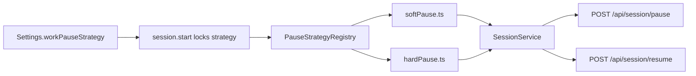

# M2 – Pause modules

Sources: [docs/product/PRD.md](../../docs/product/PRD.md) §4.6 / §5 / §12, Notion [FPMD-17](https://app.notion.com/p/3b8c8329801e8106b3bbf096c50be36f). Existing Cursor plan: [m1_timer_core.plan.md](m1_timer_core.plan.md).

## Scope (from PRD §12 + FPMD-17)

**In:** `WorkPauseStrategy` interface; isolated soft + hard modules; `workPauseStrategy: "soft" | "hard"` (soft default); Settings **Experimental features** category with a single **Enable hard pause (experimental)** checkbox (off = soft, on = hard; no Soft/Hard radios); hard pause stops the countdown and shifts `plannedEndAt` on resume; soft pause keeps FR-PAUSE-S6/S7 (planned work only; auto-rest at planned end).

**Out:** short-rest acknowledgement / live session stats (M2.5), SQLite / restart recovery of pause state (M3), PauseSlice persistence (M3), removing hard pause (Beta keep/remove).

M1 already implements soft pause **inline** in [`apps/server/src/services/session.service.ts`](../../apps/server/src/services/session.service.ts). `start()` hardcodes `pauseStrategy: "soft"`. Shared schema is `z.literal("soft")` and PUT settings **rejects** `"hard"`.

## Execution order

Five separate todos. Run them in order; **3 and 4 in the same execution** (hard module is not shipped without the Settings checkbox and frozen clock). Do not run 3 and 4 in parallel.

1. Types + API — schema `soft | hard`, generalized pause fields, `POST /pause` / `POST /resume`, M1 tests still green. Behavior remains soft-only.
2. Soft extract — `WorkPauseStrategy` + registry; move inline soft pause (including FR-PAUSE-S7) into `pause/softPause.ts`; engine calls strategy hooks only.
3. Hard module — freeze countdown while paused; shift `plannedEndAt` on resume; skip planned-end ticks while frozen; `start()` reads settings.
4. Settings + timer UI — Experimental features checkbox; timer labels and `timerFrozenAt` clock; About.
5. Tests — isolated strategy tests, FR-PAUSE-S6, hard remaining-time, manual smoke.

## Technical approach



**Locked decisions**

- Engine depends only on the strategy interface (FR-PAUSE-M1/M2). No `if (pauseStrategy === "soft")` in rest, decision, or extended-work paths. Planned-end auto-rest (FR-PAUSE-S7) lives in the **soft** module.
- Server setting remains a single field `workPauseStrategy: "soft" | "hard"` (FR-PAUSE-H1 / M4). No experimental flag, and no Soft/Hard radios, on the API or in the UI. Settings maps one checkbox: **Enable hard pause (experimental)** off → `"soft"`, on → `"hard"`. Only **Save defaults** persists it. Not a This-session override (PRD FR-SET-1).
- Strategy is copied from settings onto `ActiveSession.pauseStrategy` at start and locked for that run (same as durations).
- Unify the M1 endpoints to strategy-agnostic **`POST /api/session/pause`** and **`POST /api/session/resume`**. Remove `/soft-pause` / `/soft-resume`.
- Inject a registry into `SessionService` so a unit test can register only `soft` and prove FR-PAUSE-M3 without deleting files from the repo.

**`WorkPauseStrategy` contract** (new [`apps/server/src/pause/`](../../apps/server/src/pause/)):

| Hook | Soft | Hard |
| --- | --- | --- |
| `onPause` | Set paused flags; do not move `plannedEndAt` | Set paused flags; set `timerFrozenAt` |
| `onResume` | Close slice into `pausedSec`; `plannedEndAt` unchanged | Close slice; **shift `plannedEndAt` by paused duration**; clear freeze |
| `isCountdownFrozen` | always false (clock still ticks) | true while paused |
| `onPlannedEnd` | if still paused → auto-rest (S7); else decision | not paused (frozen ticks skipped) → decision |

`advancePlannedWork` becomes: if `strategy.isCountdownFrozen(phase)` return false; else if wall clock ≥ `plannedEndAt`, apply `strategy.onPlannedEnd(...)` then enter rest or decision. That keeps S7 out of the engine.

**Strategy-neutral planned-work fields** in [`packages/shared/src/index.ts`](../../packages/shared/src/index.ts) (replace `softPaused*`):

```ts
paused: boolean
pausedSec: number
pauseStartedAt: string | null
timerFrozenAt: string | null  // hard: pauseStartedAt while paused; soft: always null
```

UI remaining time: `remainingSecFromIso(plannedEndAt, timerFrozenAt ?? now)` — no soft/hard branch in the timer.

## Implementation phases

### Todo 1 – Types + API

- Widen `WorkPauseStrategySchema` to `z.enum(["soft", "hard"])`. Flip [`settings.service.test.ts`](../../apps/server/src/tests/services/settings.service.test.ts) from “rejects hard” to “accepts hard”.
- Add `pause` / `resume` to `SESSION_API`; drop `softPause` / `softResume`.
- Keep existing S7 + mid-work soft tests green while renaming fields and `SessionService.pause()` / `resume()`.

### Todo 2 – Soft extract

New files:

- `apps/server/src/pause/types.ts` — interface
- `apps/server/src/pause/softPause.ts`
- `apps/server/src/pause/hardPause.ts` (todo 3)
- `apps/server/src/pause/registry.ts` — default `{ soft, hard }`
- `apps/server/src/pause/index.ts`

Move `closePauseIfActive` / pause command bodies out of [`session.service.ts`](../../apps/server/src/services/session.service.ts).

### Todo 3 – Hard module

- `apps/server/src/pause/hardPause.ts`
- Registry default `{ soft, hard }`
- Hard-pause rule: while frozen, ticks must **not** fire planned-end even if wall clock is past the original `plannedEndAt`. On resume: remaining time unchanged, `plannedEndAt += now - pauseStartedAt` (PRD illustrative 25:00 / 3:00 pause / 10:00 left).
- `start(params, nowMs, pauseStrategy)` reads strategy from settings in [`session.routes.ts`](../../apps/server/src/routes/session.routes.ts) (`settings.get().workPauseStrategy`).

### Todo 4 – Settings + timer UI

[`SettingsTab.tsx`](../../apps/web/src/components/SettingsTab.tsx) layout:

```text
Settings
  Work / Short rest / Cycles / Long rest / Decision window
  [ Save defaults ]

  Experimental features
    [ ] Enable hard pause (experimental)
        Off = soft pause (default). On = hard pause.

  Debug
    [ ] Enable debug mode
    ...
```

- No Soft/Hard radios and no extra “enable experimental features” gate. The checkbox is the only work-pause control. Unchecked maps to `workPauseStrategy: "soft"`; checked maps to `"hard"`. Save sends that field with the other defaults. Default is unchecked.
- Lock the checkbox with other defaults while a session is active.
- [`ActiveTimer.tsx`](../../apps/web/src/components/timer/ActiveTimer.tsx): Pause / Resume via `SESSION_API.pause` / `resume`; label “Soft pause” vs “Hard pause”; clock freeze via `timerFrozenAt`; suffix ` · paused`.
- [`useSessionApi.ts`](../../apps/web/src/queries/useSessionApi.ts) toasts match the locked strategy.
- [`about.ts`](../../apps/web/src/constants/about.ts): “Hard pause (experimental)” → available.

### Todo 5 – Tests (FPMD-17 success criteria)

Keep M1 cases; add:

- Isolated soft/hard module tests (pause, resume, planned-end policy).
- Hard: pause 3s with 10s left → resume still 10s left, `plannedEndAt` +3s; tick past original end while paused stays in planned work.
- FR-PAUSE-S6: pause/resume rejected in decision, extended, short rest, long rest (`INVALID_PHASE`).

Manual smoke (ticket acceptance): Enable hard pause unchecked → Save → start work → Soft pause, planned end → decision (or auto-rest if still paused). Check Enable hard pause → Save → start work → pause (clock frozen) → resume (deadline shifted) → planned end → decision. Uncheck → Save → next session is soft again.
