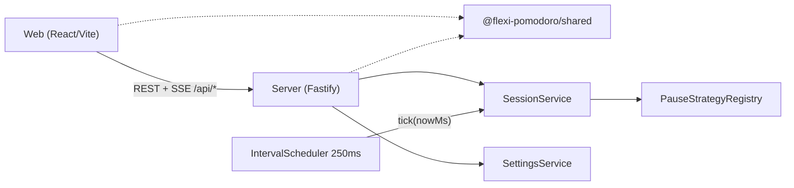

# Flexi Pomodoro — Technical Documentation

Self-hosted, flow-aware Pomodoro timer. This documentation set describes the current source tree on branch `master` (version `0.0.2-alpha.1`). Product requirements and roadmap live separately under [`product/`](./product/).

## Quick start

```bash
# Node >= 20
npm install
npm run build -w @flexi-pomodoro/shared
npm run dev          # API :3847 + Vite :5173 (proxies /api)
npm test             # server unit tests
npm run typecheck
```

Production-style single process (after `npm run build`):

```bash
npm start            # serves API + apps/web/dist on PORT (default 3847)
```

Docker:

```bash
docker compose up --build
# http://localhost:4000 (maps host 4000 → container 3847)
```

## Tech stack

| Layer | Stack |
|-------|--------|
| Monorepo | npm workspaces (`apps/*`, `packages/*`) |
| Shared types/validation | TypeScript, Zod (`@flexi-pomodoro/shared`) |
| Server | Fastify 5, `@fastify/static`, Node 20+/22 |
| Web | React 19, Vite 6, TanStack Query 5, CSS modules |
| Tests | Node.js built-in test runner (`node:test`) |
| Deploy | Multi-stage Dockerfile, docker-compose |

## Architecture (overview)



Request flow (session action): route → Zod / shared parsers → `SettingsService` / `SessionService` → `SessionSnapshot` JSON (and SSE fan-out).

## Documentation index

| Document | Contents |
|----------|----------|
| [architecture.md](./architecture.md) | Style, layers, patterns, DI, frontend/backend deep-dive |
| [structure.md](./structure.md) | Annotated tree, folder roles, where to add code |
| [modules.md](./modules.md) | Exported symbols, props, methods, imports |
| [api-reference.md](./api-reference.md) | REST + SSE endpoints, schemas, status codes |
| [data-model.md](./data-model.md) | In-memory models, phase types, DTO shapes |
| [state-management.md](./state-management.md) | React Query, contexts, localStorage, session stream |
| [error-handling.md](./error-handling.md) | Error classes, validation, client toasts |
| [security.md](./security.md) | Auth (none), CORS, secrets/env, browser storage |
| [testing.md](./testing.md) | Test stack, inventory, conventions |
| [build-and-deploy.md](./build-and-deploy.md) | Scripts, Docker, env catalog |
| [conventions.md](./conventions.md) | Naming, file layout, async, formatting |
| [dependencies.md](./dependencies.md) | Dependency inventory by category |
| [commit-history.md](./commit-history.md) | Stats, velocity, hotspots, full log |
| [glossary.md](./glossary.md) | Domain terms, phases, alerts, status values |
| [product/PRD.md](./product/PRD.md) | Product requirements (authoritative product spec) |
| [product/roadmap.md](./product/roadmap.md) | Milestone roadmap |

## Scope note

This technical documentation matches the current source tree.
