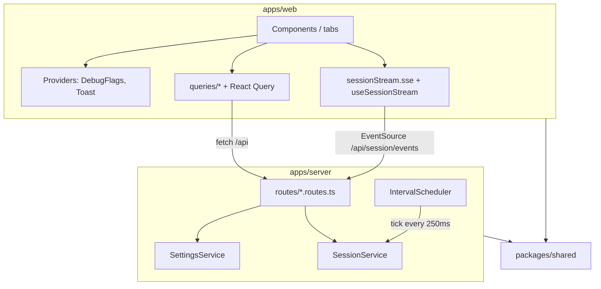
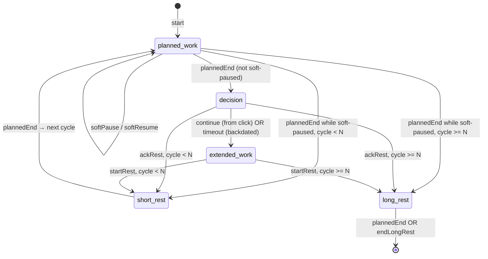

# Architecture

## Architectural style

Flexi Pomodoro is an **npm-workspace monorepo** with three packages:

| Package | Role |
|---------|------|
| `@flexi-pomodoro/shared` | Domain types, Zod schemas, `SESSION_API` path constants, debug feature catalog |
| `@flexi-pomodoro/server` | Fastify HTTP/SSE API, in-memory session engine, settings store, static web serving |
| `@flexi-pomodoro/web` | React SPA (Vite); talks to the server via REST + Server-Sent Events |

Backend style is **layered**: composition root (`app.ts`) → routes → services → (no persistence layer yet; M3 SQLite is planned). The session engine is an **in-memory state machine** advanced by wall-clock ticks (`IntervalScheduler`).

Frontend style is **feature-oriented folders** under `apps/web/src`: components (by tab/feature), providers, queries (API + React Query hooks), hooks (SSE stream), utils, constants. Tab switching is local React state (no client router).

## Layer diagram



## Design patterns in use

| Pattern | Where | Notes |
|---------|-------|-------|
| **Composition root / manual DI** | `apps/server/src/app.ts` `buildApp()` | Instantiates `SettingsService`, `SessionService`, `IntervalScheduler`; passes deps into `registerRoutes` |
| **Service layer** | `SettingsService`, `SessionService` | Business rules and state; routes stay thin |
| **Observer / pub-sub** | `SessionService.subscribe` / `notify` | SSE clients receive snapshot deltas |
| **Strategy (scheduler interface)** | `Scheduler` + `IntervalScheduler` | Comment in `scheduler.ts`: swap for deadline-based scheduler later |
| **Catalog / plugin registration** | `DEBUG_FEATURES` in `packages/shared/src/debug/catalog.ts` | Debug features register id, meta, optional `applyBounds` |
| **Schema-driven validation** | Zod schemas in shared | Shared between server routes and client start body |
| **Watermark / cursor** | Server `listenerCursors` + client `AlertSeqStore` | Alert delivery is delta-only via `sinceSeq` |
| **SPA fallback** | `app.setNotFoundHandler` | Non-API 404s serve `index.html` when `WEB_DIST` exists |

## Inversion of control / DI

No DI container. Wiring is explicit:

```typescript
// apps/server/src/app.ts (committed pattern)
const settings = new SettingsService();
const session = new SessionService();
await registerRoutes(app, { settings, session });
const scheduler = new IntervalScheduler({
  intervalMs: 250,
  onTick: (nowMs) => session.tick(nowMs, true),
});
```

On the web, React Context provides `DebugFlagsProvider` and `ToastProvider`; TanStack `QueryClientProvider` wraps the tree in `main.tsx`.

## Cross-cutting concerns

| Concern | Implementation |
|---------|----------------|
| Logging | Fastify `{ logger: true }` |
| Validation | Zod (`SessionParamsSchema`, `SettingsPatchSchema`, `parseStartSessionBody`, `DebugFlagsSchema`) |
| Error mapping | Shared `errorReply` in `apps/server/src/utils/errorReply.ts` → HTTP 400/403/409 + `{ error, code }` |
| Auth / rate limit / tracing | Not found in committed history |
| Static assets | `@fastify/static` when web dist is discoverable |
| Real-time | SSE with 25s heartbeat comments; client also polls every 5 minutes and on focus/visibility |

## Backend request lifecycle

1. **Entry** — `apps/server/src/index.ts` reads `PORT` / `HOST`, calls `buildApp()`, `listen`.
2. **App** — Fastify instance; services + routes + scheduler; optional static hosting.
3. **Route** — e.g. `POST /api/session/start` parses body via `parseStartSessionBody`, resolves params via `settings.resolveSessionParams`, calls `session.start`.
4. **Service** — mutates in-memory session; `notify()` pushes snapshots to SSE subscribers.
5. **Tick** — every 250ms `session.tick(nowMs, true)` catch-up advances due phase boundaries (wall-clock).

There are **no DB transactions**. Session and settings live in process memory only.

## Session phase state machine



`N` is `cyclesBeforeLongRest`. Rest kind is chosen by `cycleIndex >= N` → long rest, else short rest.

Decision timeout attributes elapsed decision time to **extended work** (`startedAt` = decision start). Explicit **continue** starts extended work at the click time (decision elapsed excluded). Soft-paused through planned end **skips decision** and enters rest at planned end.

## Frontend architecture

### Component hierarchy

```
main.tsx
  QueryClientProvider
    DebugFlagsProvider
      ToastProvider
        App
          Nav
          TimerTab | SettingsTab | AnalyticsStub | AboutTab
            TimerTab → IdleStartForm | ActiveTimer
            AboutTab → AboutAccordion, LinkCard, AboutIcon
```

### Smart vs presentational

| Kind | Examples |
|------|----------|
| Container / smart | `App` (queries + stream + mutations), `SettingsTab` (draft + debug), `AboutTab` (health + clipboard), `useSessionStream` |
| Presentational | `Nav`, `NumberField`, `LinkCard`, `AboutAccordion`, `ActiveTimer` (receives snapshot/phase/now) |

### Routing

No React Router. `App` holds `tab: "timer" | "settings" | "analytics" | "about"` and conditionally renders panels.

### Real-time / countdown

- **Authoritative phase changes**: SSE (`/api/session/events`) + hybrid poll fallback (`sessionStream.sse.ts`).
- **UI countdown**: local `useNow` (250ms) computes remaining/overtime from ISO anchors on the snapshot — no sub-second API polling.

### Code splitting

Not found in committed history (no `React.lazy` / dynamic import of routes).

## Alert delivery model

1. Server appends `{ seq, id }` to an alert log on transitions.
2. Snapshots include `pendingAlerts` filtered by client `sinceSeq`.
3. Client `AlertSeqStore` persists watermark in `localStorage` (`flexi-pomodoro:lastPlayedAlertSeq`).
4. On idle after active, client `syncAlertSeq()` aligns with server high-water and may reset history server-side after session end.

## Persistence (current vs planned)

| Data | M1 (committed) | Planned |
|------|----------------|---------|
| Settings | In-memory `SettingsService` (lost on restart) | SQLite (M3) |
| Session | In-memory `SessionService` | SQLite + crash recovery |
| Debug prefs | Browser `localStorage` | Client-only |
| Alert watermark | Browser `localStorage` | Client-only |
| Docker volume `/data` | Mounted stub; unused | Persistence target |
